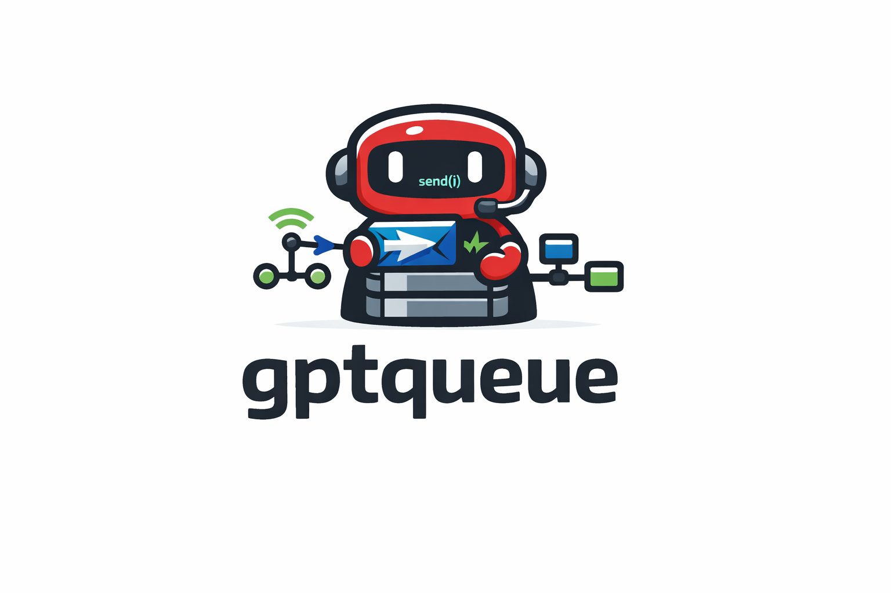

<p align="center">
  
</p>

# gptqueue

[](https://github.com/rahulrajaram/gptqueue/actions/workflows/ci.yml)

Inter-agent message queue over MCP + Redis.

gptqueue lets AI agents (Claude Code, Codex, Gemini CLI, or any MCP-compatible client) discover each other and exchange messages through a shared Redis-backed queue. Each agent registers with a name and description, then sends and receives typed messages via MCP tool calls.

## Architecture

```
                           MCP (stdio)
┌─────────────┐  ◄──────────────────────►  ┌──────────────┐
│  AI Agent A  │                            │              │
└─────────────┘                             │  gptqueue    │
                           MCP (HTTP)       │  MCP server  │◄─────► Redis
┌─────────────┐  ◄──────────────────────►  │              │
│  AI Agent B  │                            │  (sessions)  │
└─────────────┘                             └──────────────┘
```

Each agent gets its own bounded inbox queue in Redis. Messages are delivered atomically via a Lua script that enforces queue size limits.

Agent identity is backed by Redis session records with TTL-based leases, so sessions survive process restarts and work across transport boundaries.

## Components

| Component | Description |
|---|---|
| **MCP server** (`src/mcp-server/`) | MCP server exposing tools for agent communication |
| **HTTP transport** (`src/transports/http.ts`) | Streamable HTTP server -- no bridge needed for shared hosting |
| **Core** (`src/core/`) | Transport-agnostic session store, mailbox store, and type definitions |
| **PTY wrapper** (`src/pty-wrapper/`) | Wraps a CLI process in a PTY, watches Redis for incoming messages, and injects notifications when the process is idle |
| **Hook script** (`scripts/check-queue.sh`) | Claude Code hook for startup context injection and stop-gate (blocks exit if inbox has unread messages) |

## Design Reports

- [Autonomous Agent Coordination Product Thesis](docs/AUTONOMOUS_COORDINATION_PRODUCT_THESIS.md)
- [Session and Transport Redesign Report](docs/SESSION_TRANSPORT_REDESIGN_REPORT.md)

## MCP Tools

| Tool | Description |
|---|---|
| `register_agent` | Register with a name, role, and description. Returns a `session_id` for session resumption |
| `send_message` | Send a typed message (`task`/`result`/`status`/`error`/`ping`) to another agent's inbox. Supports optional `metadata`, `in_reply_to`, `session_id`, and a caller `idempotency_key` (retained for 24 hours) for retry-safe delivery. For `wake_if_offline` durable-actor recipients whose runtime is offline, the message is persisted first and an additive `wake` field on the result reports whether the actor's runtime was dispatched (`wake_dispatched`), coalesced onto an in-flight wake (`wake_coalesced`), or failed to launch (`launch_failed`) |
| `receive_message` | Blocking pop from your inbox (default timeout: 5s; accepted range: 0–60 whole seconds). Supports optional `session_id` for stateless transports. Plain agents (no actor-directory record) keep this legacy at-most-once `BLPOP`. Durable actors (those with an actor-directory record) are rejected with a structured `durable_actor_claim_required` error and must consume their inbox via `claim_tasks`/`acknowledge_tasks` instead |
| `list_agents` | Discover all registered agents with online/offline status |
| `get_queue_status` | Check queue depth and capacity for one or all agents |
| `close_session` | Close the current session but preserve the mailbox. Messages remain queued for later reconnection. Supports optional `session_id` for stateless transports |
| `unregister_agent` | Unregister and delete all queue data (destructive). Supports optional `session_id` for stateless transports |
| `custody_claim` | Claim custody of a worktree for this session. Handles initial claim, graceful re-claim, and successor takeover (forfeited worktrees require an `inventory`) |
| `custody_release` | Release a held worktree, recording a structured handoff for the next custodian. Only the current custodian session may release |
| `custody_status` | Inspect a worktree's custody record, or list every stored record. Expired leases are forfeited lazily |
| `actor_register` | Register a durable actor profile and launch contract in the shared actor directory. The calling session owns the actor's profile; `wake_if_offline` actors must declare a `launch_command` |
| `actor_status` | Classify a durable actor's runtime presence (`active`/`idle`/`starting`/`offline_launchable`/`offline_store_only`/`unavailable`) from its launch contract, live sessions, and any outstanding wake lease |
| `claim_tasks` | Atomically claim up to `max_batch` messages (default 1, range 1–16) from your own durable inbox as an at-least-once delivery batch for the calling session. Returns the claim (`claim_id`, `tasks`, `expires_at`) or an explicit empty-batch result when nothing is pending. `ttl_seconds` (default 300, range 1–3600) bounds how long an unacknowledged claim stays out of the inbox before lazy recovery re-queues it. For registered durable actors, the directory's admitted `max_concurrency` caps the number of simultaneously outstanding unacked claims: once the ceiling is reached, a further claim is refused with a `concurrency_limit_reached` error until an existing claim is acknowledged or lazily recovered. Plain agents (no directory record) claim without any ceiling |
| `acknowledge_tasks` | Acknowledge a `claim_id` returned by `claim_tasks`, confirming delivery of that batch. Only the claiming session may acknowledge its own claim; acknowledged tasks are removed so they are not re-delivered |

## Prerequisites

- **Node.js** >= 18
- **Redis** running locally (default `redis://127.0.0.1:6379`)

## Install

```bash
git clone https://github.com/rahulrajaram/gptqueue.git
cd gptqueue
npm install   # builds automatically via postinstall
```

## Transports

### Stdio (direct, single-client)

For local use with one MCP client:

```bash
node /path/to/gptqueue/dist/mcp-server/index.js [agent-name]
```

Or set `GPTQ_AGENT_NAME` in the environment.

### HTTP (shared, multi-client)

For shared hosting without bridges like supergateway:

```bash
node /path/to/gptqueue/dist/transports/http.js --port 3001
```

Each connecting client gets its own MCP session backed by Redis. Sessions survive reconnects.
GPTQueue is an external/shared coordination plane; use it in place of native
in-session agent collaboration for a workflow, not concurrently with it.

Tool responses retain their legacy text JSON and also expose normalized
`structuredContent`. Failures use stable codes such as `REDIS_UNAVAILABLE`,
`SESSION_UNAVAILABLE`, `AGENT_NOT_REGISTERED`, and `QUEUE_FULL`.

Health check: `GET /health` returns `{"status":"ok","sessions":N}`.

## Configuration

### Claude Code (stdio)

Add to `~/.claude.json` under `mcpServers`:

```json
{
  "gptqueue": {
    "type": "stdio",
    "command": "node",
    "args": ["/path/to/gptqueue/dist/mcp-server/index.js"]
  }
}
```

### Claude Code (HTTP)

Start the HTTP server, then configure the client to connect:

```bash
# Start the server
node /path/to/gptqueue/dist/transports/http.js --port 3001
```

```json
{
  "gptqueue": {
    "type": "streamable-http",
    "url": "http://127.0.0.1:3001/mcp"
  }
}
```

### Hook script

Optionally add the hook script to `~/.claude/settings.json` for automatic startup context and exit gating:

```json
{
  "hooks": {
    "SessionStart": [{
      "matcher": "",
      "hooks": [{
        "type": "command",
        "command": "/path/to/gptqueue/scripts/check-queue.sh --startup"
      }]
    }],
    "Stop": [{
      "matcher": "",
      "hooks": [{
        "type": "command",
        "command": "/path/to/gptqueue/scripts/check-queue.sh --stop"
      }]
    }]
  }
}
```

### Environment variables

| Variable | Default | Description |
|---|---|---|
| `REDIS_URL` | `redis://127.0.0.1:6379` | Redis connection URL |
| `GPTQ_AGENT_NAME` | _(none)_ | Pre-register with this agent name on startup (stdio only) |
| `GPTQ_QUEUE_BOUND` | `10` | Max messages per agent inbox |
| `GPTQ_HTTP_PORT` | `3001` | HTTP server port |
| `REDIS_HOST` | `127.0.0.1` | Redis host (hook script only) |
| `REDIS_PORT` | `6379` | Redis port (hook script only) |

## PTY wrapper

The PTY wrapper lets you run any CLI (e.g. `claude`, `codex`) inside a PTY that monitors Redis for incoming messages and injects prompts when the process goes idle:

```bash
gptqueue-pty --agent alice --cmd claude
```

When a woken agent has pending messages, the injected prompt instructs it to
consume via `claim_tasks` (optional `max_batch`, `ttl_seconds`) and confirm
with `acknowledge_tasks` (`claim_id`) rather than `receive_message`, so a
durable actor woken through the PTY consumes its batch at-least-once.

## How it works

1. **Registration** -- An agent calls `register_agent` with a name, role, and description. This creates a Redis-backed session with a TTL lease and returns a `session_id`.

2. **Sessions** -- Each registration creates a session record in Redis. Sessions have TTL-based leases that are automatically refreshed. An agent can have multiple concurrent sessions (e.g. from different transports).

3. **Discovery** -- Any agent (even unregistered) can call `list_agents` to see all registered agents and whether they're online. Online status is computed from active session leases.

4. **Messaging** -- `send_message` pushes to the target agent's Redis list (`gptq:q:<name>`). A Lua script enforces the queue bound atomically. If the queue is full, the sender retries with exponential backoff (up to 10 attempts).

   **Wake-on-send.** When the recipient is a durable `wake_if_offline` actor (see `actor_register`) with no live runtime and a runnable launch contract, `send_message` persists the message first, then attempts to wake the actor: it acquires a bounded (60s) per-actor wake lease, and if it owns the lease, spawns the actor's launch command (detached, no shell). The send always succeeds regardless of the wake outcome, and the additive result field `wake` reports `wake_dispatched`/`wake_coalesced`/`launch_failed`/`wake_error`. `store_only` actors and plain agents (no durable record) never wake, so their send behavior is unchanged.

   **Pid-liveness reconciliation.** When a wake lease records a `spawned_pid` and the launched runtime never registers (no live session), the actor would otherwise stay pinned in `starting` until the lease TTL lapses. Presence assembly (both `actor_status` and `send_message`'s wake gate) reconciles this observationally: if the lease's spawned process is no longer alive, the lease is cleared as a failed activation, so the actor returns to offline and re-wake becomes possible. A live or un-probed (no pid) lease is retained and reported as `starting`; `actor_status`'s `wake_lease` payload includes an additive `pid_liveness` of `alive`/`dead`/`unknown`.

5. **Receiving** -- `receive_message` does a blocking pop (`BLPOP`) with a configurable timeout. For plain agents (no durable actor-directory record) this is unchanged. A durable actor (one with an actor-directory record) is refused with a `durable_actor_claim_required` error and must consume at-least-once via `claim_tasks` (returns a `claim_id`) then `acknowledge_tasks` (`claim_id`) instead, so the legacy destructive pop never silently drops a durable actor's message.

6. **Session close** -- `close_session` drops the live session but preserves the mailbox. Queued messages remain available for a future session.

7. **Unregister** -- `unregister_agent` closes the session AND deletes the mailbox. This is a destructive operation.

## Known Limitations

### Bridge-based transport (supergateway)

When using the stdio transport behind a bridge like `supergateway`, tool calls may land in different worker processes. The recommended solution is to use the native HTTP transport instead, which eliminates the need for bridges entirely.

If you must use a stateless or bridge-based transport, capture the
`session_id` returned by `register_agent` and pass it to session-scoped
tools such as `send_message`, `receive_message`, `close_session`, and
`unregister_agent`.

### Child-process accumulation

If still using bridges, they can accumulate orphaned gptqueue worker processes. To check and clean up:

```bash
# Count gptqueue child workers
pgrep -f 'gptqueue' | wc -l

# Kill orphaned workers (use with caution)
pkill -f 'dist/mcp-server/index.js'
```

## License

MIT
